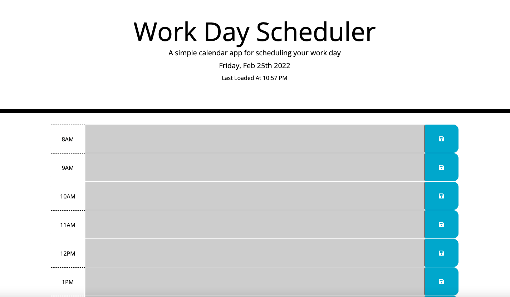
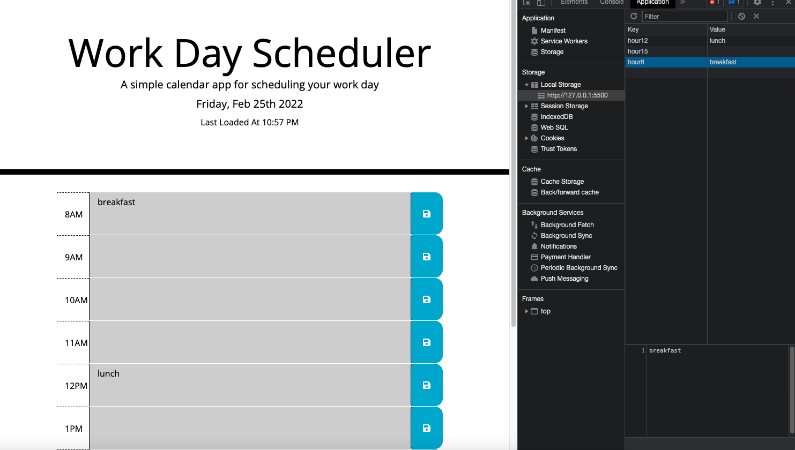

# Daily-Planner
Github Repo: https://github.com/SamiF812/Daily-Planner
Deployed App: https://samif812.github.io/Daily-Planner/

Created a daily planner.

Once you open the page you are given a clean layout with the current day being displayed on top of the calender. For added assistance I also include a time stamp of the time you loaded the page which could help with me scheduling tasks.

All the timeblocks were created via bootstrap. They are color coded based on if they are past present or future of the current time. This current time is being pulled from moment.

When you click on a timeblock you can enter a note or task within that box. Once something is input you can save it by hitting the button added via font awesome. 

When the button is hit the text and time within that time block is saved to local storage. Once saved you are able to reload the page without losing the data you had input.

PS: When these screenshots were taken, it was past the hours avaiable for the timeblocks so all are grade out. 

Email: DjSamiF@gmail.com
Phone: 201-468-2130
